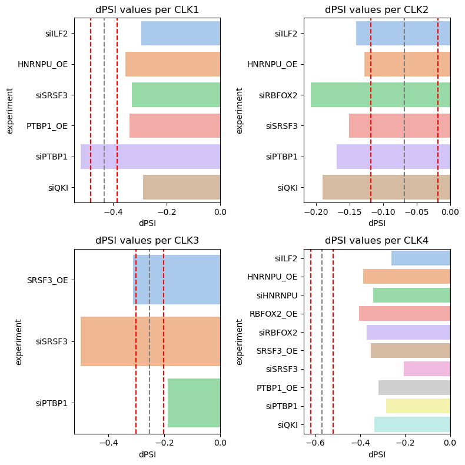

# Evolution-and-regulation-CLK-paralogues

Author: Antonina Kuznetsova, mail: kuznetsova.antonina@outlook.com

## Table of content

- [Introduction](#introduction)

- [Aims and objectives](#aims-and-objectives)

- [Data](#data)

- [Workflow](#workflow)

- [Results](#results)

- [Conclusions](#conclusions)

- [Literature](#literature)

## Introduction

This repository focuses on the CLK family of dual-specificity protein kinases, which consists of 4 human paralogues. These kinases play a key role in regulating alternative splicing (AS) — a critical mechanism of eukaryotic gene expression and adaptation.

This codebase provides tools to:

- Detect unproductive splicing (US) events in CLK paralogues

- Identify associated regulatory patterns, such as RNA-binding protein (RBP) motifs and RNA secondary structures

- Construct phylogenetic tree to explore evolutionary relationships among CLK paralogues

By combining sequence analysis and regulatory feature detection, this project aims to uncover conserved mechanisms that shape splicing outcomes across CLK paralogous genes.

## Aims and objectives

**Aim:**
Study unproductive splicing event in CLK and its regulation during evolution

**Objectives:**
- Reconstruction of evolutionary events and construction of phylogenetic tree
- Assessment of the reactivity of exons involved in US in human and mouse
- Predicting regulation of US by RNA-binding proteins (RBP)
- Search for RBP binding sites


## Data

RNA-seq data, including both _in-house_ generated and publicly available datasets from the NCBI Gene Expression Omnibus (GEO) under _accession number GSE159295_ were used.

For phylogenetic analysis 64 CLK homologs from 28 different species were used, the IDs and sequences were taken from the Uniprot database (see table ```./data/CLK_proteins.csv```).

## Workflow

### Alignment with STAR

RNA-seq data were aligned using [STAR](https://doi.org/10.1093/bioinformatics/bts635) version 2.7.10b with default parametrs:
- RAW - /path/to/raw_data
- ANT - /path/to/annotation_file
- IND - /path/to/genome_indices_directory
- DIR - /path/to/FASTQ_file
- OUT_DIR - prefix for all output files

```
STAR --runThreadN 12  --runMode genomeGenerate --genomeDir ${IND} --genomeFastaFiles ${RAW} --sjdbGTFfile ${ANT}

STAR --genomeDir ${IND} --readFilesIn ${DIR}_R1_001.fastq.gz ${DIR}_R2_001.fastq.gz  --runThreadN 12 --outFileNamePrefix ${OUT_DIR} --outSAMtype BAM SortedByCoordinate
```

### Transcriptome analysis with pyIPSA

To get splice junctions and sites the [pyIPSA](https://github.com/Leoberium/pyIPSA) pipeline was used. All steps have been taken according to the developers. 

For futher analysis J6 and S6 files were used. They were processed with code in ```./Merge_pyIPSA_results.ipynb```. The result was a table with all cassete exons ``.csv`` and a track for [UCSC genome browser](https://genome.ucsc.edu/) ``.bed``. On the custom track we can see clearly what uproductive splicing events are occurring in the genome. The example of this track is in ```./data/cassete_exons_PC3_control_chx.bed```

||
|:--:|
| _Custom track for UCSC._ |

### Reactivity of exons

Reactivity of exons was done in human and mice. The idea was to compare cassete exons from previous step and from annotation. If there is no cassete exon in annotation we can say that it is a poison exon, which leads to formation of PTC and gets a suffix _poison.

The code for this step in ```./Exons_reactivity.ipynb```.

### Regulation by RNA binding proteins

We have RNA-seq data of knockdown and overexpresion of several RBPs (QKI, PTBP1, ILF2, RBFOX2, SRSF3, HNRNPU, TARDBP) with and without cycloheximide. The data was processed with pyIPSA and cassete exons were obtained. Regulation was assessed relative to dPSI of untreated cells. These results were then visualised for clarity. 

The code for this step in ```./RBP_regulation.ipynb```.

### RBP binding sites 

In previous step significant impacts of RBPs were obtained. Firstly, for these proteins binding sites were searched in [POSTAR3](https://doi.org/10.1093/nar/gkab702) and [ATtRACT](https://doi.org/10.1093/database/baw035) database. Secondly, we tried to find conserved regions in alignment and match them with known binding sites using [MEME Suite](https://doi.org/10.1093/nar/gkv416) tool.

The code for this step in ```./RBP_binding_sites.ipynb```. Sequences of CLKs in fasta file ```./data/clk.fasta```.

### Phylogenetic analysis

Protein sequences were aligned with [MAFFT](https://doi.org/10.1093/nar/gkf436) v7.526, then evolution model was choosed and phylogenetic tree was constructed with [IQ-TREE2](https://doi.org/10.1093/molbev/msaa015) version 2.3.6. Tree visualization was performed by [iTOL](https://itol.embl.de/).

```
mafft --auto output_clks.fasta > output_clks_mafft.fasta

iqtree2 -m MFP -s output_clks_mafft.fasta --prefix CLKs_MF2
cat CLKs_MF2.iqtree

iqtree2 -s output_clks_mafft.fasta -m Q.mammal+I+R5 -pre CLKs_Q_B_alrt_abayes -bb 1000 -alrt 1000 -abayes
```

### RNA secondary structures

RNA secondary structures were searched in conserved regions. Handle alingment was done with Python [Biotite](https://www.biotite-python.org/latest/index.html) version 1.1.0, Vienna format was made with Python [RNA](https://viennarna.readthedocs.io/en/latest/api_python.html) version 2.7.0. [RNAcanvas](https://rnacanvas.app/) was used to visualise RNA secondary structures. 

The code for this step in ```./RNA_secondary_structures.ipynb```.

## Results

The US event was assessed using Percent Spliced-In (PSI). It was shown that for all paralogues of the CLK family in human and mouse data the PSI of exon 4 changes under cycloheximide. 

||
|:--:|
| _Reactivity of exons in human and mouse._ |

Next, the effects of knockdown and overexpression of RBPs on the PSI of this event were analysed. From 3 to 10 significant PSI changes were obtained for each gene. In all of them there was the knockdown effect of SRSF3 and PTBP1. Then RBP binding motifs were searched for in databases POSTAR3 and ATRACT and in conserved regions of paralogs’ alignments for RBPs that have shown a significant effect. No significant motive was found. 

||
|:--:|
| _Regulation of exon 4 in PC3 cell line under KD/OE of RBPs. Grey dotted line is dPSI of untreated cells (UT), red dotted line is dPSI of UT ± 0.05._ |

For phylogenetic analysis protein sequences of 64 CLK homologs from 28 different species were used. The phylogenetic tree was built to obtain common regulatory mechanisms between the paralogues. It shows that CLK2 was the ancestor, and CLK1 and CLK4 diverged later than all the others. In addition, CLK1 and CLK4 were found to share a common RNA secondary  structure, looping out exon 4, that potentially may regulate AS.

||
|:--:|
| _Phylogenetic tree of CLK family._ |

||
|:--:|
| _RNA secondary structure in CLK1 and CLK4._ |

## Conclusions

- A conserved unproductive splicing event involving exon 4 was identified in all human CLK paralogues. This event leads to the formation of PTC and degradation via the NMD pathway.
- Knockdown of RNA-binding proteins SRSF3 and PTBP1 significantly affected exon 4 inclusion across all CLK genes, indicating shared regulatory influences across paralogues.
- No conserved binding motifs were found, and the regulatory effects of RBP knockdown varied between genes, suggesting context-dependent RBP activity and paralogue-specific cis-regulatory environments.
- Phylogenetic analysis revealed that CLK2 is the ancestral gene, while CLK1 and CLK4 diverged more recently. 
- RNA secondary structure analysis revealed a conserved stem–loop structure around exon 4 in CLK1 and CLK4. This structure may play a role in splicing regulation.


## Literature

Makarova, K. S., Wolf, Y. I., Mekhedov, S. L., Mirkin, B. G., & Koonin, E. V. (2005). Ancestral paralogs and pseudoparalogs and their role in the emergence of the eukaryotic cell. Nucleic Acids Research, 33(14), 4626–4638. https://doi.org/10.1093/nar/gki775

Bullock, A. N., Das, S., Debreczeni, J. É., Rellos, P., Fedorov, O., Niesen, F. H., Guo, K., Papagrigoriou, E., Amos, A. L., Cho, S., Turk, B. E., Ghosh, G., & Knapp, S. (2009). Kinase domain insertions define distinct roles of CLK kinases in SR protein phosphorylation. Structure, 17(3), 352–362. https://doi.org/10.1016/j.str.2008.12.023

​​Moyano, P. M., Němec, V., & Paruch, K. (2020). CDC-Like Kinases (CLKs): biology, chemical probes, and therapeutic potential. International Journal of Molecular Sciences, 21(20), 7549. https://doi.org/10.3390/ijms21207549

Desai, A., Hu, Z., French, C. E., Lloyd, J. P. B., & Brenner, S. E. (2020). Networks of splice factor regulation by unproductive splicing coupled with nonsense mediated mRNA decay. bioRxiv (Cold Spring Harbor Laboratory). https://doi.org/10.1101/2020.05.20.107375

Fair, B., Najar, C. F. B. A., Zhao, J., Lozano, S., Reilly, A., Mossian, G., Staley, J. P., Wang, J., & Li, Y. I. (2024). Global impact of unproductive splicing on human gene expression. Nature Genetics, 56(9), 1851–1861. https://doi.org/10.1038/s41588-024-01872-x

Yang, R., Feng, X., Arias-Cavieres, A., Mitchell, R. M., Polo, A., Hu, K., Zhong, R., Qi, C., Zhang, R. S., Westneat, N., Portillo, C. A., Nobrega, M. A., Hansel, C., Garcia, A. J., III, & Zhang, X. (2023). Upregulation of SYNGAP1 expression in mice and human neurons by redirecting alternative splicing. Neuron, 111(10), 1637-1650.e5. https://doi.org/10.1016/j.neuron.2023.02.021

Song, X., Wan, X., Huang, T., Zeng, C., Sastry, N., Wu, B., James, C. D., Horbinski, C., Nakano, I., Zhang, W., Hu, B., & Cheng, S. (2019). SRSF3-Regulated RNA alternative splicing promotes glioblastoma tumorigenicity by affecting multiple cellular processes. Cancer Research, 79(20), 5288–5301. https://doi.org/10.1158/0008-5472.can-19-1504

Bartys, N., Kierzek, R., & Lisowiec-Wachnicka, J. (2019). The regulation properties of RNA secondary structure in alternative splicing. Biochimica Et Biophysica Acta (BBA) - Gene Regulatory Mechanisms, 1862(11–12), 194401. https://doi.org/10.1016/j.bbagrm.2019.07.002
